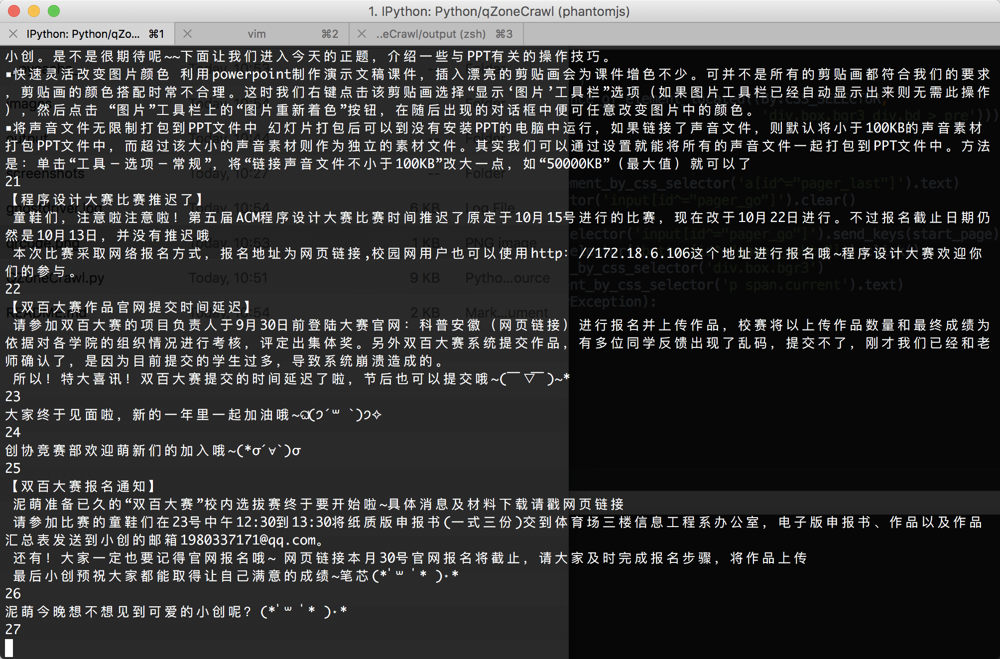
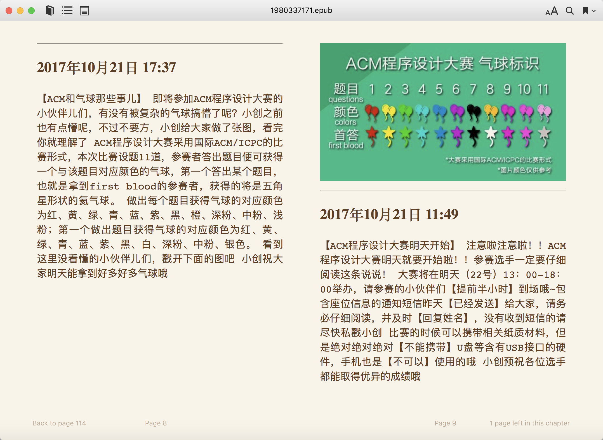

# QZoneCrawler
QQ空间爬虫，完善中...

## 依赖库
- [PhantomJS](http://phantomjs.org/download.html)
- [Chrome driver](https://sites.google.com/a/chromium.org/chromedriver/downloads)
```
$ apt-get install libzbar0, pandoc
$ pip install selenium
$ pip install pillow
$ pip install pyzbar
$ pip install qrcode
$ pip install pypandoc
```

## 运行
```python
In [64]: qzone = QZoneCrawl.QZoneCrawl(1980337171, timeout=30)

In [65]: qzone.crawl(1, qzone.feed_info)
请扫描二维码登陆：./qrcode.png
登陆成功！
当前抓取对象： 1980337171
page: 1 / 27
0
【小创五岁啦~(*´▽｀*)】
 小创今天收到了好多好多童鞋的生日祝福和礼物，真的是超级开心超级感动啊五年陪伴，接下来小创一定会更加努力地帮助同学们，为大家服务哒~(｀•ω•´)ゞ
 最后，新的一岁的愿望是——
变成更好的小创！＼（￣︶￣）／
1
【失物招领】
To 一个妹子
 你在交双百大赛作品时，把U盘落在行政楼114王老师那里了，小创提醒你快去拿哦~(∗❛ั∀❛ั∗)✧*。
2
【庆祝第五届ACM程序设计大赛圆满成功】
 早早开始报名，又推迟举办日期，这样的比赛是不是有些千呼万唤始出来的感觉呢？没错，ACM程序设计大赛就是这样一个令人期待的比赛，今天它终于圆满结束了，小创在这里感谢童鞋们的参与。
 比赛一开始，紧张的气氛便充满了赛场。面对十一道程序设计题目的 刁难，选手们经受住了考验。经过五个小时的奋斗，共有52名同学在比赛中获奖，你们真的很棒棒喔 。没有获奖同学，小创同样要为你们的积极参与点赞。
 五彩缤纷的气球夺人眼球，紧张激烈的气氛扣人心弦，这就是ACM程序设计大赛。下届比赛，小创依旧与你们相约。
 ...

 In [66]: qzone.save_feeds()
```

## 效果图




